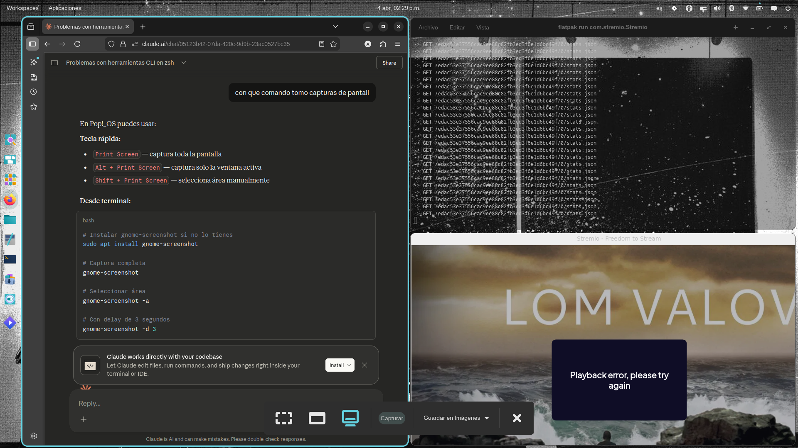

# Wildlife Telemetry Node 🛰️

Arduino-based wildlife telemetry node simulating GPS tracking and LoRa radio transmission for conservation field deployments.

Built as Track A of a dual-track conservation technology project developed at UPIEM–IPN.

## Overview

This project simulates a field-deployable telemetry node that:

- Reads GPS coordinates (NEO-6M module)
- Transmits data packets via LoRa radio (Ra-02, 433MHz)
- Logs timestamped location data for wildlife monitoring

Target deployment: sea turtle nesting beaches and tropical wildlife reserves.

## Hardware (Target)

- Arduino Uno / ESP32
- GPS module: u-blox NEO-6M
- LoRa radio: Ra-02 (SX1278, 433MHz)

## Simulation

A Python simulator replicates the node's serial output and logs data to CSV for testing the pipeline without physical hardware.

```bash
pip install pandas folium
python src/simulation/serial_simulator.py
```

Visualize the simulated trajectory:

```bash
python src/simulation/visualizar_live.py
```

## Project Structure

wildlife-telemetry-node/
├── src/
│ ├── telemetry_node.ino # Arduino sketch (GPS + LoRa)
│ └── simulation/
│ ├── serial_simulator.py # Python node simulator
│ └── visualizar_live.py # Trajectory map generator
├── data/ # Local logs (not uploaded)
├── docs/ # Wiring diagrams and schematics
└── README.md

## Telemetry Packet Format

NODE_ID,latitude,longitude,speed_kmh,satellites,timestamp
NODE_01,10.200350,-83.281900,2.1,8,2026-04-12T21:15:36Z

## Live Dashboard



## Related Project

[wildlife-telemetry-pipeline](https://github.com/toshi-taz/wildlife-telemetry-pipeline) — Data processing and visualization pipeline (Movebank API + pandas + Folium)

## Author

Alexander Toshiro Bataz López  
Ingeniería en Sistemas Energéticos y Redes Inteligentes — UPIEM–IPN  
Conservation Technology | Wildlife Telemetry | IoT Sensor Networks
z
